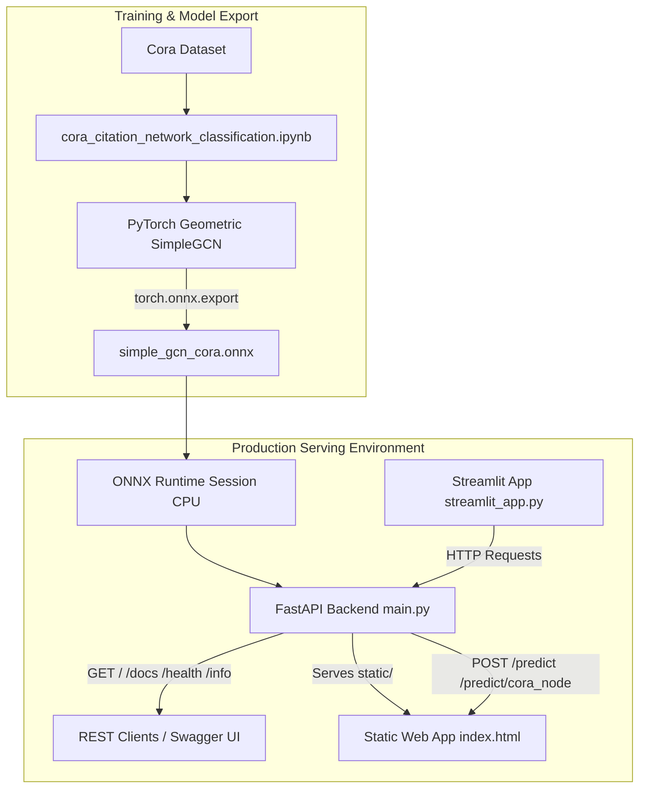

# Research Topic Classification with Graph Neural Networks

An end-to-end node classification system on the Cora citation network using PyTorch Geometric, ONNX Runtime, FastAPI, and Streamlit.

[](https://www.python.org/)
[](https://fastapi.tiangolo.com/)
[](https://streamlit.io/)
[](https://pytorch.org/)
[](https://pytorch-geometric.readthedocs.io/)
[](https://onnxruntime.ai/)
[](LICENSE)

---

## Table of Contents

- [Overview](#overview)
- [Key Features](#key-features)
- [Live Demos](#live-demos)
- [System Architecture](#system-architecture)
- [Machine Learning Pipeline](#machine-learning-pipeline)
- [Dataset](#dataset)
- [Model Specification](#model-specification)
- [Notebook & Experimental Benchmarks](#notebook--experimental-benchmarks)
- [API Reference](#api-reference)
- [Frontend Interfaces](#frontend-interfaces)
  - [Static Web Application](#1-static-web-application)
  - [Streamlit Application](#2-streamlit-application)
- [Project Structure](#project-structure)
- [Installation & Setup](#installation--setup)
- [Running the System](#running-the-system)
- [Example API Usage](#example-api-usage)
- [Reproducibility](#reproducibility)
- [Limitations](#limitations)
- [Troubleshooting](#troubleshooting)
- [Security & Production Considerations](#security--production-considerations)
- [References](#references)
- [License](#license)

---

## Overview

This repository implements a Graph Neural Network (GNN) pipeline that classifies research papers into one of seven academic topics based on the **Cora citation dataset**.

Traditional machine learning algorithms process documents using feature vectors (e.g., bag-of-words or TF-IDF representations) in isolation. However, scientific literature inherently forms a **citation network**:
* **Graph Node**: A research paper represented by a 1,433-dimensional binary bag-of-words feature vector.
* **Graph Edge**: A directed citation link between two papers.
* **Node Target**: One of seven research subject categories.

By utilizing a **Graph Convolutional Network (GCN)**, the model performs message passing across citation edges, aggregating neighborhood features to boost classification accuracy beyond content-only baselines.

The trained PyTorch model is exported to an **ONNX** format for lightweight, CPU-optimized deployment via **FastAPI**, with dual frontend user interfaces provided via a static web app and a **Streamlit** dashboard.

---

## Key Features

* **GCN Citation Network Inference**: Evaluates node classification over citation graphs using a trained 2-layer Graph Convolutional Network.
* **ONNX Runtime Serving**: High-performance CPU inference via ONNX Runtime without requiring PyTorch at runtime for custom graph predictions.
* **REST API with FastAPI**: Clean, typed endpoints for health checks, model metadata inspection, real Cora node lookups, and custom graph evaluations.
* **Dual Frontend Options**:
  * **Static Single-Page Application**: Native HTML5/JS frontend served directly by FastAPI, featuring an HTML5 Canvas citation visualizer and latency benchmarking tool.
  * **Streamlit Explorer**: Interactive Python dashboard for interactive dataset exploration and random custom graph generation.
* **Custom Graph Support**: Accepts arbitrary node feature matrices and edge lists for real-time inference on user-defined graph topologies.

---

## Live Demos

* **Interactive Streamlit UI**: [researchtopicclassification.streamlit.app](https://researchtopicclassification-77apphog4wbvydizrgvdph.streamlit.app/)
* **FastAPI Backend Service**: [research-topic-classification.onrender.com](https://research-topic-classification.onrender.com)
* **API Documentation (Swagger)**: [research-topic-classification.onrender.com/docs](https://research-topic-classification.onrender.com/docs)

> **Note**: Hosted backend instances on free-tier platforms may experience cold starts. Hosted services are provided for demonstration purposes and carry no uptime guarantees.

---

## System Architecture

The project cleanly separates offline experimentation/export from online runtime inference:



### Data Flow during Inference
1. **Client Request**: The client passes either Cora node indices (`POST /predict/cora_node`) or a custom feature matrix and edge index (`POST /predict`).
2. **Feature Preparation**: FastAPI formats node feature vectors `[num_nodes, 1433]` and edge indices `[2, num_edges]`.
3. **ONNX Execution**: ONNX Runtime executes tensor operations on CPU and returns raw logit outputs `[num_nodes, 7]`.
4. **Post-Processing**: Logits are converted to normalized class probabilities using Softmax, returning predicted class IDs, topic names, probabilities, and raw logits.

---

## Machine Learning Pipeline

```
┌─────────────────┐    ┌─────────────────┐    ┌─────────────────┐    ┌─────────────────┐
│  Dataset Load   │───>│ Feature & Graph │───>│ GCN Training    │───>│ ONNX Export     │
│  Planetoid Cora │    │ Construction    │    │ (2-Layer Conv)  │    │ Opset 18        │
└─────────────────┘    └─────────────────┘    └─────────────────┘    └─────────────────┘
                                                                              │
┌─────────────────┐    ┌─────────────────┐    ┌─────────────────┐             │
│ Web / Streamlit │<───│ FastAPI Service │<───│ ONNX Runtime    │<────────────┘
│ User Interfaces │    │ Endpoint Routing│    │ CPU Inference   │
└─────────────────┘    └─────────────────┘    └─────────────────┘
```

1. **Dataset Ingestion**: Downloads and caches the Planetoid Cora dataset inside `data/Planetoid/Cora/`.
2. **Graph Construction**: Constructs an undirected graph $G = (V, E)$ with $|V| = 2708$ papers and $|E| = 10556$ citations.
3. **Baseline Comparison**: Trains a Random Forest classifier on TF-IDF transformed features as a non-graph baseline.
4. **GCN Training**: Trains `SimpleGCN` using cross-entropy loss over 140 training nodes with early stopping based on validation accuracy (500 nodes).
5. **ONNX Export**: Exports the trained PyTorch model with dynamic input dimensions (`num_nodes` and `num_edges`) to `simple_gcn_cora.onnx`.
6. **Inference Serving**: Loads the `.onnx` model into an ONNX Runtime `InferenceSession` for sub-millisecond local predictions.

---

## Dataset

The **Cora Citation Network** (`Planetoid/Cora`) consists of computer science research papers categorized into 7 subjects.

### Dataset Specifications

| Property | Value | Description |
| :--- | :--- | :--- |
| **Nodes ($|V|$)** | `2,708` | Total research papers in the graph |
| **Edges ($|E|$)** | `10,556` | Citation links between papers |
| **Feature Dimension** | `1,433` | Binary bag-of-words indicators (0 or 1) |
| **Target Classes** | `7` | Research topic categories |
| **Train Mask** | `140` | 20 papers per class |
| **Val Mask** | `500` | Validation evaluation nodes |
| **Test Mask** | `1,000` | Unseen test evaluation nodes |

### Class Label Mapping

| Class ID | Class Name | Description |
| :---: | :--- | :--- |
| `0` | `Case_Based` | Case-based reasoning literature |
| `1` | `Genetic_Algorithms` | Evolutionary computation and genetic algorithms |
| `2` | `Neural_Networks` | Deep learning, connectionist models, and neural nets |
| `3` | `Probabilistic_Methods` | Bayesian methods, Markov models, and graphical models |
| `4` | `Reinforcement_Learning` | Q-learning, policy search, and MDPs |
| `5` | `Rule_Learning` | Inductive logic programming and rule extraction |
| `6` | `Theory` | Computational learning theory and formal proofs |

### File Storage (`data/Planetoid/Cora/`)
* `raw/`: Raw Planetoid files (`ind.cora.x`, `ind.cora.graph`, etc.).
* `processed/`: Processed PyTorch Geometric binary data (`data.pt`, `pre_filter.pt`, `pre_transform.pt`).

---

## Model Specification

The model architecture (`SimpleGCN`) consists of two Graph Convolutional layers (`GCNConv`) with dropout regularization.

```
Input [num_nodes, 1433] ──> GCNConv(1433 -> 32) ──> ReLU ──> Dropout(0.5) ──> GCNConv(32 -> 7) ──> Logits [num_nodes, 7]
                                ▲                                                 ▲
                                │                                                 │
Edge Indices [2, num_edges] ────┴─────────────────────────────────────────────────┘
```

### Model Properties

| Parameter | Value |
| :--- | :--- |
| **Architecture** | 2-Layer Graph Convolutional Network (`SimpleGCN`) |
| **Convolution Layer 1** | `GCNConv(in_channels=1433, out_channels=32)` |
| **Activation & Regularization** | `ReLU`, `Dropout(p=0.5)` |
| **Convolution Layer 2** | `GCNConv(in_channels=32, out_channels=7)` |
| **Output Shape** | `[num_nodes, 7]` (Raw Logits) |
| **Export Format** | ONNX (Opset Version 18) |
| **Inference Engine** | ONNX Runtime (`CPUExecutionProvider`) |
| **Model Files** | `simple_gcn_cora.onnx` (~400 KB), `simple_gcn_cora.onnx.data` |

---

## Notebook & Experimental Benchmarks

Experimental evaluation is recorded in `cora_citation_network_classification.ipynb`. A non-graph baseline (Random Forest with TF-IDF features) was evaluated alongside the GCN model on the standard Planetoid 1,000-node test split.

### Measured Notebook Results

| Model | Input Information | Test Accuracy | Test Macro-F1 |
| :--- | :--- | :---: | :---: |
| **Random Forest Baseline** | Node Features (TF-IDF bag-of-words) | `0.581` (58.1%) | `0.570` |
| **SimpleGCN (PyG)** | Node Features + Citation Edges | **`0.815` (81.5%)** | **`0.808`** |

> **Key Insight**: Incorporating citation structure via message passing improves classification accuracy by **+23.4 percentage points** over content-only feature classification.
>
> *Note: These figures represent experimental metrics from notebook runs on the standard benchmark split and are not guaranteed SLA metrics for arbitrary custom graphs.*

---

## API Reference

The FastAPI service (`main.py`) exposes typed REST endpoints.

### 1. Health Check
```http
GET /health
```
**Response (200 OK):**
```json
{
  "status": "healthy",
  "providers": [
    "CPUExecutionProvider"
  ]
}
```

### 2. Model Metadata
```http
GET /info
```
**Response (200 OK):**
```json
{
  "Model Name": "SimpeGCN",
  "feature_dimension": 1433,
  "num_classes": 7,
  "class_mapping": {
    "0": "Case_Based",
    "1": "Genetic_Algorithms",
    "2": "Neural_Networks",
    "3": "Probabilistic_Methods",
    "4": "Reinforcement_Learning",
    "5": "Rule_Learning",
    "6": "Theory"
  },
  "inputs": [
    {"name": "node_features", "shape": ["num_nodes", 1433], "type": "tensor(float)"},
    {"name": "edge_indices", "shape": [2, "num_edges"], "type": "tensor(int64)"}
  ],
  "outputs": [
    {"name": "logits", "shape": ["num_nodes", 7], "type": "tensor(float)"}
  ]
}
```

### 3. Real Cora Node Prediction
```http
POST /predict/cora_node
```
Predicts topics for specific papers in the Cora dataset by node index (`0` to `2707`).

**Request Body:**
```json
{
  "node_indices": [0, 42]
}
```

**Response (200 OK):**
```json
{
  "num_nodes": 2708,
  "num_edges": 10556,
  "predictions": [
    {
      "node_index": 0,
      "predicted_class_id": 2,
      "predicted_class_name": "Neural_Networks",
      "probabilites": [0.0001, 0.0002, 0.9981, 0.0008, 0.0003, 0.0002, 0.0003],
      "logits": [-2.14, -1.82, 6.78, -0.45, -1.21, -1.95, -1.54]
    }
  ]
}
```

### 4. Custom Graph Prediction
```http
POST /predict
```
Evaluates custom feature vectors `[num_nodes, 1433]` and optional citation edges `[2, num_edges]`. If `edge_indices` is omitted, the API automatically constructs self-loops.

**Request Body:**
```json
{
  "node_features": [
    [0.0, 1.0, 0.0, "... 1433 floats total ..."],
    [1.0, 0.0, 0.0, "... 1433 floats total ..."]
  ],
  "edge_indices": [
    [0, 1],
    [1, 0]
  ]
}
```

---

## Frontend Interfaces

### 1. Static Web Application
Served by FastAPI from the `static/` folder (`index.html`, `index.css`, `app.js`).
* **Cora Benchmark Explorer**: Selects papers by node index (0–2707) or preset quick chips, rendering predictions alongside an **HTML5 Canvas local citation network visualization**.
* **Custom Paper & Graph Predictor**: Interactive builder for custom graph nodes with presets (e.g., AI keywords vs. Math keywords).
* **Latency Benchmark Tool**: Executes 5 consecutive full-graph API requests to measure end-to-end response latency.

### 2. Streamlit Application
A standalone Python dashboard implemented in `streamlit_app.py`.
* Configurable API base URL with built-in health checker.
* Probability breakdown bar charts and raw logit inspection.
* Random custom graph generator with feature vector sampling and citation chain construction.

```bash
streamlit run streamlit_app.py
```

---

## Project Structure

```text
Research_Topic_Classification/
├── data/
│   └── Planetoid/
│       └── Cora/
│           ├── processed/       # Cached PyG dataset files (data.pt)
│           └── raw/             # Raw dataset archives
├── static/
│   ├── index.html               # FastAPI-served single-page app
│   ├── index.css                # Visual styling & theme definition
│   └── app.js                   # Client-side API interactions & Canvas graph renderer
├── cora_citation_network_classification.ipynb  # Training, baseline & ONNX export notebook
├── main.py                      # FastAPI REST API & ONNX Runtime service
├── streamlit_app.py             # Streamlit interactive Explorer frontend
├── simple_gcn_cora.onnx         # Exported ONNX model graph
├── simple_gcn_cora.onnx.data    # Exported ONNX model weights
├── requirements.txt             # Python runtime dependencies
├── .gitignore                   # Version control exclusion rules
├── LICENSE                      # MIT License file
└── README.md                    # Project documentation
```

---

## Installation & Setup

### Prerequisites
* Python 3.9+
* `pip` package manager

### 1. Clone Repository
```bash
git clone https://github.com/sumitjadhav1703/Research_Topic_Classification.git
cd Research_Topic_Classification
```

### 2. Set Up Virtual Environment
```bash
# macOS / Linux
python3 -m virtualenv .venv
source .venv/bin/activate

# Windows (PowerShell)
python -m virtualenv .venv
.venv\Scripts\activate
```

### 3. Install Dependencies
```bash
pip install -r requirements.txt
```

---

## Running the System

### Option A: Start FastAPI Server (Includes Static Frontend)
```bash
uvicorn main:app --host 0.0.0.0 --port 8000 --reload
```
* **Static Web App**: Open [http://localhost:8000](http://localhost:8000)
* **Swagger API Docs**: Open [http://localhost:8000/docs](http://localhost:8000/docs)
* **Health Check**: Open [http://localhost:8000/health](http://localhost:8000/health)

### Option B: Start Streamlit Frontend
In a separate terminal window:
```bash
streamlit run streamlit_app.py
```
* **Streamlit UI**: Open [http://localhost:8501](http://localhost:8501)

---

## Example API Usage

### Health Check (`curl`)
```bash
curl -X GET "http://localhost:8000/health"
```

### Classify Cora Nodes (`curl`)
```bash
curl -X POST "http://localhost:8000/predict/cora_node" \
     -H "Content-Type: application/json" \
     -d '{"node_indices": [0, 42]}'
```

### Classify Custom Graph (`Python`)
```python
import requests

url = "http://localhost:8000/predict"

# Construct 2 nodes with 1,433 binary features
node_1 = [1.0 if i in [10, 25, 100] else 0.0 for i in range(1433)]
node_2 = [1.0 if i in [5, 15, 30] else 0.0 for i in range(1433)]

payload = {
    "node_features": [node_1, node_2],
    "edge_indices": [[0, 1], [1, 0]]  # Bidirectional citation link
}

response = requests.post(url, json=payload)
print(response.json())
```

---

## Reproducibility

To re-run training, evaluation, and ONNX model export from scratch:

1. Open Jupyter Notebook:
   ```bash
   jupyter notebook cora_citation_network_classification.ipynb
   ```
2. Run all cells sequentially:
   * Downloads `Planetoid/Cora`.
   * Evaluates the Random Forest baseline on TF-IDF features.
   * Trains `SimpleGCN` with early stopping.
   * Re-exports `simple_gcn_cora.onnx` (opset 18).

---

## Limitations

* **Fixed Feature Dimension**: Node feature inputs must strictly contain exactly 1,433 float values matching the original vocabulary index.
* **Domain Specificity**: The model is trained exclusively on the Cora dataset taxonomy (7 predefined topics).
* **CPU Inference**: The default API deployment uses `CPUExecutionProvider`. For high-throughput production environments, ONNX Runtime GPU/TensorRT execution providers should be configured.
* **Transductive Benchmark Setup**: The standard Planetoid split uses 140 training nodes; out-of-distribution graphs without citation links fall back to self-loop message passing.

---

## Troubleshooting

| Issue | Cause | Solution |
| :--- | :--- | :--- |
| `HTTP 422: Each node's feature vector must exactly have 1433 features` | Custom input feature vector length != 1,433 | Ensure feature arrays contain exactly 1,433 numerical elements. |
| `HTTP 400: node_index out of bound` | Requested index outside `0` to `2707` | Pass valid node IDs within the range `[0, 2707]`. |
| `failed to load cora dataset` / SSL Error | Network restriction downloading Planetoid data | Ensure internet connectivity. The notebook includes SSL fallback configuration (`ssl._create_unverified_context`). |
| Streamlit shows `API Disconnected` | FastAPI server is not running | Start FastAPI (`uvicorn main:app --port 8000`) and verify the API URL setting in the Streamlit sidebar. |

---

## Security & Production Considerations

### Implemented Safeguards
* **Input Validation**: Pydantic models enforce type checking and feature vector dimensionality validation.
* **Error Handling**: Explicit HTTP exception handling for out-of-bound indices and invalid array shapes.

### Recommended Hardening for Production
* **Authentication**: Add API Key or OAuth2 JWT authentication middleware to FastAPI endpoints.
* **Rate Limiting**: Implement rate-limiting middleware to prevent API abuse.
* **CORS Middleware**: Configure explicit allowed origins via FastAPI `CORSMiddleware`.
* **Containerization**: Package the service using Docker for reproducible cloud deployments.

---

## References

* **Cora Dataset**: Yang et al., *Revisiting Semi-Supervised Learning with Graph Embeddings*, ICML 2016.
* **GCN Paper**: Kipf & Welling, *Semi-Supervised Classification with Graph Convolutional Networks*, ICLR 2017.
* **PyTorch Geometric**: Fey & Lenssen, *Fast Graph Representation Learning with PyTorch Geometric*, ICLR Workshop 2019.
* **ONNX Runtime**: [onnxruntime.ai](https://onnxruntime.ai)
* **FastAPI**: [fastapi.tiangolo.com](https://fastapi.tiangolo.com)

---

## License

This project is licensed under the **MIT License** — see the [LICENSE](LICENSE) file for details.

---

**Author**: Sumit Jadhav
**Repository**: [github.com/sumitjadhav1703/Research_Topic_Classification](https://github.com/sumitjadhav1703/Research_Topic_Classification)
